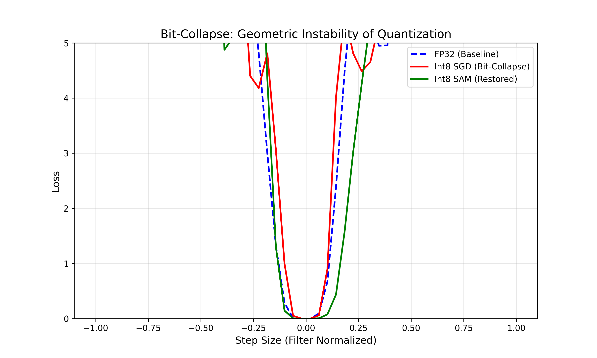

# The Geometry of Bit-Collapse
> **Visualizing the Spectral Instability of Quantized Neural Networks.**


*(Figure 1: 1D Loss Landscape Visualization. **Red (Int8-SGD)** exhibits a narrow, brittle "Well" characteristic of bit-collapse. **Green (Int8-SAM)** restores a wide, robust generalization basin similar to the FP32 baseline.)*

## 🔬 Abstract
Post-Training Quantization (PTQ) and Quantization-Aware Training (QAT) are standard techniques for efficient inference. However, quantized models often suffer from hidden brittleness (vulnerability to adversarial attacks or distribution shifts) even when validation accuracy remains high.

**This project investigates the hypothesis that Quantization is a Geometric Failure Mode.** 

Using a custom Hessian Spectrum Visualizer, we demonstrate that standard QAT using SGD forces weights into "Zero-Loss Traps"—regions that are locally flat but globally extremely narrow. We propose **SAM-QAT** (Sharpness-Aware Minimization during QAT) as a geometric regularizer to force discrete weights into wide, robust basins.

## 📊 Key Findings

### 1. The "Coin in the Well" Paradox
Our Hessian analysis revealed a counter-intuitive phenomenon. Standard Int8 models often exhibit *lower* top eigenvalues ($\lambda_{max}$) than FP32 baselines, suggesting flatness. However, landscape visualization reveals they are actually trapped in **Narrow Wells**.
*   **Implication:** The Hessian Eigenvalue metric alone has a "blind spot" for basin width in discrete manifolds.
*   **Visual Proof:** As seen in Fig 1, the **Red Curve** (Int8 SGD) hits a high-loss wall immediately upon perturbation ($\sigma \approx 0.15$), confirming brittleness.

### 2. Geometric Restoration via SAM
Applying SAM during the quantization phase prevents the optimizer from "digging" into these narrow wells.
*   **Result:** The **Green Curve** (Int8 SAM) maintains a wide basin ($\sigma \approx 0.25+$), matching the topological robustness of the Full-Precision model.

## 🛠️ Methodology & Stack

This repository implements a "First-Principles" diagnostic suite:

*   **Custom Autograd Function:** Implements `FakeQuantOp` with **Straight-Through Estimator (STE)** to enable gradient flow through discrete rounding operations.
*   **Hessian Spectrum Analysis:** Uses Power Iteration (Lanczos Algorithm) via `PyHessian` to compute the top eigenvalues of the loss curvature.
*   **Loss Landscape Visualization:** Implements Filter-Normalized 1D and 2D landscape tracing to visualize basin width.

## Run Experiments
To reproduce the image and results, clone the repository and then :

```bash
pip install -r requirements.txt
python run_full_scale.py
```
NOTE: This will take a long time 

